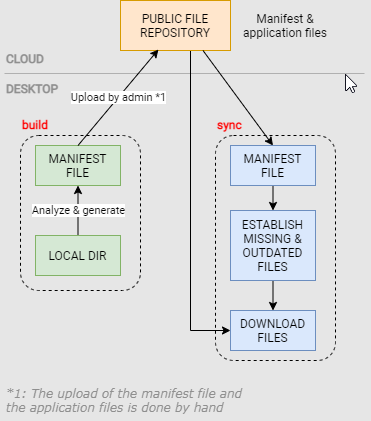

Desktop multi-platform updater. Admins uploads their application to a public repository and end-users download missing or changed files only from the same repository



## How to use

### Parameters

- **remoteUrl**: Where the `manifest.json` and downloadable files are hosted. URL should be public.
- **localDirectory** *(default `.`)*: Indicates from where manifest will be created for **build** cmd and where files will be downloaded for **sync** cmd.

#### With local config file

Create the following file named `updater.json`

```json
{
  "remoteUrl": "https://mysite.com/files",
  "localDirectory": "./myfiles"
}
```

#### Without local config file

Use the following execution arguments (will always be priority against the file settings)

- `-remoteUrl=https://mysite.com/files`
- `-localDirectory=myfiles`

### Running the application

The applications supports the following execution commands

**build**
Generates the manifest file of the current directory (and children). The application itself is excluded from the manifest.

**sync**
Used by end users. Download remote manifest, evaluates which files are missing or changed and downloads originals from public repository (remoteUrl).

**help, -h, --help**
Provides usage information

## Changelog

**0.2.0**
- Add support for `localDirectory` parameter.
- Config validation will now consider which command is being executed.
- Add help command

**0.1.0**
- Init